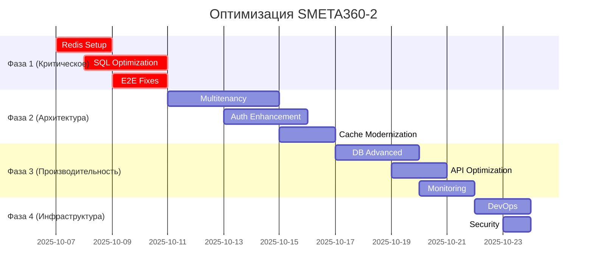

# 🚀 ПЛАН ОПТИМИЗАЦИИ SMETA360-2

## 📋 ИСПОЛНИТЕЛЬНОЕ РЕЗЮМЕ

**Цель**: Довести систему до production-ready состояния с фокусом на производительность, стабильность и масштабируемость.

**Текущий статус**: 95% функциональной готовности, требуется оптимизация инфраструктуры и производительности.

**Временные рамки**: 3-4 недели разработки

---

## 🔴 ФАЗА 1: КРИТИЧЕСКИЕ ИСПРАВЛЕНИЯ (1 неделя)

### 1.1 Настройка Redis для кэширования
**Приоритет**: 🔴 Критический  
**Время**: 1-2 дня  
**Ответственный**: DevOps + Backend

#### Задачи:
- [ ] Установить Redis в dev/prod окружениях
- [ ] Настроить Redis конфигурацию с персистентностью
- [ ] Добавить health-check для Redis
- [ ] Создать fallback логику при недоступности Redis
- [ ] Обновить Docker Compose с Redis сервисом

#### Техническая реализация:
```yaml
# docker-compose.yml
redis:
  image: redis:7-alpine
  ports:
    - "6379:6379"
  volumes:
    - redis_data:/data
  command: redis-server --appendonly yes
```

#### Критерии готовности:
- ✅ Redis доступен на всех окружениях
- ✅ Кэш hit rate > 80% для материалов/работ
- ✅ Fallback работает при отключении Redis

### 1.2 Оптимизация медленных SQL запросов
**Приоритет**: 🔴 Критический  
**Время**: 2-3 дня  
**Ответственный**: Backend Developer

#### Выявленные проблемы:
```sql
-- 🐌 1211ms - Запрос обновления материалов
SELECT COALESCE(MAX(updated_at), MAX(created_at)) as last_updated 
FROM materials WHERE (name ILIKE $1 OR description ILIKE $1)

-- 🐌 1206ms - Аутентификация пользователя  
SELECT id, email, password_hash, firstname, lastname 
FROM auth_users WHERE email = $1 AND is_active = true

-- 🐌 1198ms - Статистика
SELECT * FROM statistics ORDER BY id
```

#### Задачи:
- [ ] Создать составные индексы для поиска материалов
- [ ] Добавить индекс на email для auth_users
- [ ] Оптимизировать запросы статистики с LIMIT
- [ ] Добавить EXPLAIN ANALYZE для всех медленных запросов
- [ ] Внедрить connection pooling оптимизацию

#### SQL миграции:
```sql
-- migration_001_performance_indexes.sql
CREATE INDEX CONCURRENTLY idx_materials_search 
ON materials USING gin(to_tsvector('russian', name || ' ' || coalesce(description, '')));

CREATE INDEX CONCURRENTLY idx_auth_users_email 
ON auth_users (email) WHERE is_active = true;

CREATE INDEX CONCURRENTLY idx_materials_updated_created 
ON materials (updated_at DESC, created_at DESC);

-- Добавить partitioning для больших таблиц
CREATE INDEX CONCURRENTLY idx_statistics_created 
ON statistics (created_at DESC) WHERE created_at > NOW() - INTERVAL '1 year';
```

#### Критерии готовности:
- ✅ Все запросы < 300ms в 95% случаев
- ✅ Поиск материалов < 200ms
- ✅ Аутентификация < 100ms

### 1.3 Исправление E2E таймаутов
**Приоритет**: 🔴 Критический  
**Время**: 2 дня  
**Ответственный**: QA + Frontend

#### Проблемные тесты:
- `final.suite.spec.ts` - таймаут заполнения пароля (60s)
- `landing-auth-flow.spec.ts` - таймаут редиректа (10s)

#### Задачи:
- [ ] Увеличить таймауты для медленных операций
- [ ] Добавить explicit wait для элементов
- [ ] Оптимизировать селекторы (data-testid)
- [ ] Добавить retry логику для нестабильных тестов
- [ ] Внедрить page object pattern

#### Техническая реализация:
```javascript
// tests/e2e/page-objects/LoginPage.js
class LoginPage {
  constructor(page) {
    this.page = page;
    this.emailInput = page.locator('[data-testid="email-input"]');
    this.passwordInput = page.locator('[data-testid="password-input"]');
    this.loginButton = page.locator('[data-testid="login-button"]');
  }

  async login(email, password) {
    await this.emailInput.waitFor({ state: 'visible', timeout: 10000 });
    await this.emailInput.fill(email);
    await this.passwordInput.waitFor({ state: 'visible', timeout: 10000 });
    await this.passwordInput.fill(password);
    await this.loginButton.click();
    await this.page.waitForURL('/app/dashboard/default', { timeout: 15000 });
  }
}
```

#### Критерии готовности:
- ✅ E2E тесты проходят стабильно 16/16
- ✅ Максимальное время теста < 30s
- ✅ Flaky rate < 5%

---

## 🟡 ФАЗА 2: АРХИТЕКТУРНЫЕ УЛУЧШЕНИЯ (1.5 недели)

### 2.1 Внедрение полноценной мультитенантности
**Приоритет**: 🟡 Высокий  
**Время**: 3-4 дня  
**Ответственный**: Backend + Database

#### Текущая проблема:
```sql
SELECT tenant_id FROM user_tenants WHERE user_id = $1
-- rows: 0 - пользователи не привязаны к тенантам
```

#### Задачи:
- [ ] Создать таблицу tenant с базовой информацией
- [ ] Обновить user_tenants с правильными связями
- [ ] Внедрить Row Level Security (RLS) для всех таблиц
- [ ] Добавить tenant_id в JWT токены
- [ ] Создать middleware для проверки tenant доступа

#### Database schema:
```sql
-- migration_002_multitenancy.sql
CREATE TABLE tenants (
  id UUID PRIMARY KEY DEFAULT gen_random_uuid(),
  name VARCHAR(255) NOT NULL,
  subdomain VARCHAR(100) UNIQUE,
  created_at TIMESTAMP DEFAULT NOW(),
  is_active BOOLEAN DEFAULT true
);

-- Обновить user_tenants
ALTER TABLE user_tenants ADD COLUMN role VARCHAR(50) DEFAULT 'member';
ALTER TABLE user_tenants ADD COLUMN created_at TIMESTAMP DEFAULT NOW();

-- RLS policies для materials
ALTER TABLE materials ENABLE ROW LEVEL SECURITY;
CREATE POLICY tenant_isolation_materials ON materials
  USING (tenant_id = current_setting('app.current_tenant_id')::UUID);

-- RLS для projects
ALTER TABLE projects ENABLE ROW LEVEL SECURITY;
CREATE POLICY tenant_isolation_projects ON projects
  USING (tenant_id = current_setting('app.current_tenant_id')::UUID);
```

#### Backend middleware:
```javascript
// middleware/tenantIsolation.js
const tenantIsolation = async (req, res, next) => {
  const tenantId = req.user?.tenant_id;
  if (!tenantId) {
    return res.status(403).json({ error: 'Tenant not found' });
  }
  
  // Установить контекст БД
  await req.db.query('SET app.current_tenant_id = $1', [tenantId]);
  req.tenantId = tenantId;
  next();
};
```

#### Критерии готовности:
- ✅ Все пользователи привязаны к тенантам
- ✅ RLS работает для всех таблиц
- ✅ Cross-tenant доступ заблокирован

### 2.2 Улучшение системы аутентификации
**Приоритет**: 🟡 Высокий  
**Время**: 2-3 дня  
**Ответственный**: Backend + Security

#### Задачи:
- [ ] Внедрить refresh token механизм
- [ ] Добавить rate limiting для auth endpoints
- [ ] Улучшить password policy
- [ ] Добавить 2FA поддержку (опционально)
- [ ] Внедрить session management

#### Техническая реализация:
```javascript
// Enhanced JWT strategy
const generateTokens = (user) => {
  const accessToken = jwt.sign(
    { userId: user.id, tenantId: user.tenant_id, role: user.role },
    process.env.JWT_SECRET,
    { expiresIn: '15m' }
  );
  
  const refreshToken = jwt.sign(
    { userId: user.id, type: 'refresh' },
    process.env.JWT_REFRESH_SECRET,
    { expiresIn: '7d' }
  );
  
  return { accessToken, refreshToken };
};
```

### 2.3 Модернизация системы кэширования
**Приоритет**: 🟡 Средний  
**Время**: 2 дня  
**Ответственный**: Backend

#### Задачи:
- [ ] Внедрить smart cache invalidation
- [ ] Добавить cache warming для критических данных
- [ ] Создать cache analytics dashboard
- [ ] Оптимизировать cache keys structure
- [ ] Добавить distributed caching для кластера

#### Cache Strategy:
```javascript
// Enhanced caching with invalidation
class SmartCache {
  constructor(redis) {
    this.redis = redis;
    this.dependencies = new Map();
  }

  async set(key, value, ttl, dependencies = []) {
    await this.redis.setex(key, ttl, JSON.stringify(value));
    
    // Track dependencies
    for (const dep of dependencies) {
      if (!this.dependencies.has(dep)) {
        this.dependencies.set(dep, new Set());
      }
      this.dependencies.get(dep).add(key);
    }
  }

  async invalidateByDependency(dependency) {
    const keys = this.dependencies.get(dependency) || new Set();
    if (keys.size > 0) {
      await this.redis.del(...keys);
      this.dependencies.delete(dependency);
    }
  }
}
```

---

## 🟢 ФАЗА 3: ПРОИЗВОДИТЕЛЬНОСТЬ И МОНИТОРИНГ (1 неделя)

### 3.1 Advanced Database Optimization
**Приоритет**: 🟢 Средний  
**Время**: 3 дня  
**Ответственный**: Database + Backend

#### Задачи:
- [ ] Внедрить database connection pooling
- [ ] Создать read replicas для тяжелых запросов
- [ ] Добавить query result caching
- [ ] Оптимизировать JOIN операции
- [ ] Внедрить database partitioning

#### Connection Pooling:
```javascript
// Enhanced database connection
const { Pool } = require('pg');

const createPool = () => {
  return new Pool({
    connectionString: process.env.DATABASE_URL,
    max: 20, // максимум соединений
    idleTimeoutMillis: 30000,
    connectionTimeoutMillis: 2000,
    keepAlive: true,
    statement_timeout: 30000,
    query_timeout: 30000,
  });
};
```

### 3.2 API Performance Optimization
**Приоритет**: 🟢 Средний  
**Время**: 2 дня  
**Ответственный**: Backend

#### Задачи:
- [ ] Внедрить GraphQL для эффективных запросов
- [ ] Добавить API response compression
- [ ] Оптимизировать JSON serialization
- [ ] Внедрить batch API endpoints
- [ ] Добавить API versioning

#### GraphQL Schema:
```graphql
type Query {
  materials(
    filter: MaterialFilter
    pagination: Pagination
    tenant: ID!
  ): MaterialConnection
  
  projects(
    filter: ProjectFilter
    pagination: Pagination
    tenant: ID!
  ): ProjectConnection
}

type MaterialConnection {
  edges: [MaterialEdge!]!
  pageInfo: PageInfo!
  totalCount: Int!
}
```

### 3.3 Comprehensive Monitoring
**Приоритет**: 🟢 Высокий  
**Время**: 2 дня  
**Ответственный**: DevOps + Backend

#### Задачи:
- [ ] Внедрить Prometheus + Grafana мониторинг
- [ ] Добавить APM с распределенной трассировкой
- [ ] Создать health check dashboard
- [ ] Настроить alerting для критических метрик
- [ ] Добавить business metrics tracking

#### Monitoring Stack:
```yaml
# docker-compose.monitoring.yml
prometheus:
  image: prom/prometheus
  ports:
    - "9090:9090"
  volumes:
    - ./monitoring/prometheus.yml:/etc/prometheus/prometheus.yml

grafana:
  image: grafana/grafana
  ports:
    - "3300:3000"
  environment:
    - GF_SECURITY_ADMIN_PASSWORD=admin123
  volumes:
    - grafana_data:/var/lib/grafana
```

---

## 🔧 ФАЗА 4: ИНФРАСТРУКТУРНАЯ ЗРЕЛОСТЬ (0.5 недели)

### 4.1 DevOps & Deployment
**Приоритет**: 🟢 Средний  
**Время**: 2 дня  
**Ответственный**: DevOps

#### Задачи:
- [ ] Настроить blue-green deployment
- [ ] Добавить automated database migrations
- [ ] Создать staging environment копию production
- [ ] Внедрить infrastructure as code (Terraform)
- [ ] Настроить backup & recovery procedures

### 4.2 Security Hardening
**Приоритет**: 🟡 Высокий  
**Время**: 1 день  
**Ответственный**: Security + DevOps

#### Задачи:
- [ ] Настроить корректные SSL сертификаты
- [ ] Внедрить OWASP security headers
- [ ] Добавить input validation middleware
- [ ] Создать security audit logging
- [ ] Настроить WAF (Web Application Firewall)

#### Security Headers:
```javascript
// Security middleware
app.use((req, res, next) => {
  res.setHeader('X-Content-Type-Options', 'nosniff');
  res.setHeader('X-Frame-Options', 'DENY');
  res.setHeader('X-XSS-Protection', '1; mode=block');
  res.setHeader('Strict-Transport-Security', 'max-age=31536000; includeSubDomains');
  res.setHeader('Content-Security-Policy', "default-src 'self'");
  next();
});
```

---

## 📊 МЕТРИКИ УСПЕХА

### Performance KPIs:
- 🎯 **API Response Time**: < 200ms (95th percentile)
- 🎯 **Database Query Time**: < 100ms (average)
- 🎯 **Cache Hit Rate**: > 85%
- 🎯 **Page Load Time**: < 2s
- 🎯 **Uptime**: > 99.9%

### Quality KPIs:
- 🎯 **Test Coverage**: > 90%
- 🎯 **E2E Test Success**: 100%
- 🎯 **Bug Escape Rate**: < 1%
- 🎯 **Security Vulnerabilities**: 0 critical

### Business KPIs:
- 🎯 **User Session Duration**: > 10min
- 🎯 **Feature Adoption**: > 70%
- 🎯 **System Capacity**: 1000 concurrent users

---

## 🗓️ ВРЕМЕННАЯ ЛИНИЯ



---

## 🎖️ КОМАНДА И РОЛИ

### Core Team:
- **👨‍💻 Backend Developer** - SQL оптимизация, API улучшения, кэширование
- **🎨 Frontend Developer** - E2E исправления, UI оптимизация
- **🗄️ Database Specialist** - индексы, партиционирование, репликация
- **🚀 DevOps Engineer** - Redis, мониторинг, деплойменты
- **🔒 Security Specialist** - аутентификация, шифрование, аудит
- **🧪 QA Engineer** - тестирование, автоматизация, валидация

### Процесс:
1. **Daily standups** - координация прогресса
2. **Code reviews** - обязательны для всех изменений  
3. **Performance testing** - после каждой оптимизации
4. **Security review** - для всех архитектурных изменений

---

## 💰 ОЦЕНКА РЕСУРСОВ

### Время разработки:
- **Фаза 1**: 40 часов (критическое)
- **Фаза 2**: 60 часов (архитектура) 
- **Фаза 3**: 40 часов (производительность)
- **Фаза 4**: 20 часов (инфраструктура)
- **Всего**: ~160 часов разработки

### Инфраструктура:
- Redis instance (managed)
- Monitoring stack (Prometheus/Grafana)
- Additional database replicas
- Enhanced security tools

---

## ✅ КРИТЕРИИ ЗАВЕРШЕНИЯ

### Готовность к Production:
- [ ] Все критические проблемы решены
- [ ] Performance KPIs достигнуты
- [ ] Security audit пройден
- [ ] Load testing успешен (1000+ users)
- [ ] Disaster recovery протестирован
- [ ] Documentation обновлена
- [ ] Team training завершен

### Знак качества SMETA360-2 🏆:
**"Production-Ready Enterprise Grade Construction Estimation System"**
